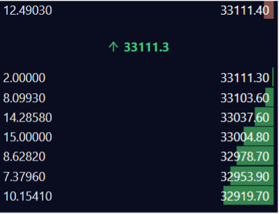

### How many MAPS are being sold as part of the IDO:

- 2,000,000 MAPS will be auctionned off

### When can I bid for MAPS?

- You have 16 minutes to place bids on the orderbook between February 1st, 21:45 SGT - February 1st, 22:01 SGT.

### If your order does not get filled.

- You will manually be required to cancel your bid order. Once you cancel your order you must settle your funds to send them back to your wallet.

### What price does the bidding start at?

- You can start bidding at $0.10 per MAPS Token. Price increments vary by $0.01. For instance, if you start bidding at $0.10, the next available price increment is $0.11.

### Are there any limitations in the number of MAPS I can buy?

- There aren’t any limitations in place. You only need to buy more than 1 MAPS token to have a valid order.

### What is the trading pair of the IDO?

- The trading pair will be MAPS/USDT. This market will appear roughly 15 minutes before to allow for participants to bid on the auction.

### What happens after the 16-minute bidding allocation time?

- After the 16 minutes of bidding the MAPS will be distributed. This will result in 2,000,000 MAPS being market sold to the highest bidders first. A scenario of this will be: from 0.13-0.15 there are over 2 million bids for MAPS. Those who are in the first 2 million spots will get filled. If you had a bid at 0.12 you will not get filled.

### Can I change my bid during the 15 minutes?

- Yes. You will have to cancel your open order first and replace an order.

### In the auction would I be able to see other bids?

- Yes, you will be able to see other participants auctions. It will appear as a standard orderbook format.

- Here is an example of the orderbook: Disregard the prices as it is only for demonstration purposes.
  - The 2,000,000 MAPS will allocated to the sell order (RED)
  - Participants bids will appear as buy orders (GREEN)

# Technical FAQs:

### Creating a Bonfida supported wallet.

Complete guide can be found here: https://serum-academy.com/en/serum-dex/sol-wallet/

- To connect to the Bonfida DEX, you will be required to make a wallet.
  - A list of supported wallets on the DEX can be found here: https://serum-academy.com/en/serum-dex/sol-wallet/

### Sending funds to your SPL Wallet:

- An in-depth guide can be found here: https://serum-academy.com/en/serum-dex/sol-wallet/

### How to convert ERC-20 to SPL tokens:

- This route will depend on what exchange you sending from. For example if you are using FTX you will able to send SPL tokens directly to your Sollet or Bonfida wallets.

- If you are using binance and other popular exchanges will be required to convert the token to SPL format by Metamask.

- An exact guide on doing this can be found here: https://serum-academy.com/en/serum-dex/sol-wallet/#convert-erc20-to-spl-tokens

### How can I connect to the Bonfida DEX:

- Now that you have made a wallet and have transferred funds to it. You will be required to connect to the DEX. This will prompt a new tab to open as it will establish a connection with the exchange. Keep this open.
- Ensure you are using Chrome or similar browser
- A complete guide can be found here: https://serum-academy.com/en/serum-dex/connect-wallet/

### Trading on the Bonfida DEX:

- Now that you have connected to the DEX, the next step in bidding on the MAPS IDO is to find the pair. This will appear as MAPS/USDT.
- A step-by-step guide can be found here: https://serum-academy.com/en/serum-dex/trade/
- A complete video demonstration can be found here: https://www.youtube.com/watch?v=tAbHRHJo1To&t=378s
