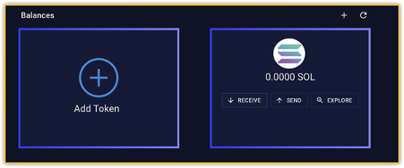
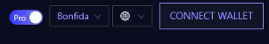
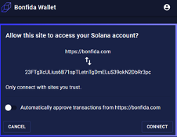
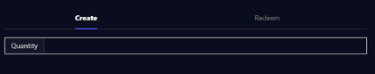
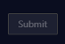
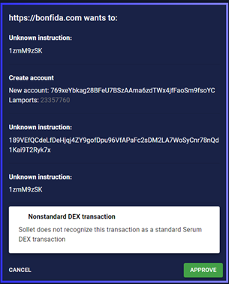

## Wallet Creation

1. Go to [Bonfida Wallet](https://bonfida.com/wallet)

   - Create new wallet, or restore an existing one

2. Press **RECEIVE** to send SOL. To pay for transaction and address creation roughly 0.5 SOL is required.

3. Note that for **OXY** you will need 1 FIDA for every 10 USDC, e.g if you intend to invest 1,000 USDC then you need 100 FIDA

4. Click on **Add Token** and select **FIDA**

5. Also add **USDC**

Deposit **USDC** and **FIDA** into your newly created token accounts.

## Entering the IDO

1. Go to [the Serum IDO page](https://bonfida.com/dex/#/ido)

2. **Connect** your wallet if it isn’t connected.

3. **Approve** access to your wallet.

4. Click the **Deposit** tab and input the amount of USDC worth of OXY you would like to buy. It will automatically work the 10:1 ratio of FIDA required.

5. Click the **Submit** button.

6. **Approve** the transaction in the wallet pop up.

7. Your **USDC and FIDA** will be deposited into the pool. From 9:55pm to 10:00pm UTC+8 the pool will be locked and **USDC** swapped for **OXY** tokens.

8. At 10:00pm UTC+8 the pool will unlock and you will be able withdraw from the pool using the withdraw tab.

9. Click **Submit**

10. **Approve** the transaction.

11. The **OXY & FIDA** tokens are now in **YOUR** wallet.

## Rules

- The pool will open March 16th 8pm UTC+8 and will close March 16th 9:55pm UTC+8
- During the 2-hour time period people will be able to deposit USDC + FIDA in the pool with a 10:1 ratio
- The FIDA deposited in the pool will not be burned
- The deposit limit is max 5,000 USDC + 500 FIDA per person
- The pool itself does not have a maximum deposit amount
- IDO price is 0.125 USDC per OXY token
- From 9:55pm to 10:00pm, 2,000,000 OXY tokens will be swapped for 250,000 USDC
- If there is more than 250,000 USDC deposited in the pool in total, the remaining USDC will not be swapped and will remain in the pool
- After 10:00pm, people will be able to withdraw (remaining USDC + OXY + FIDA) from the pool
- Users final allocation will be based on the amount of funds they put in as a percentage of all funds put in by other users at the time the IDO ends.
- This model allows everyone to have an allocation

## Examples

- User A deposits 5,000 USDC + 500 FIDA during the window period
- OXY = $0.125 USDC

### Scenario 1: Fully Subscribed

- Total 250,000 USDC + 25,000 FIDA has been deposited into the pool
- From 9:55 to 10:00pm, 250,000 USDC will be swapped for 2,000,000 OXY
- After 10:00pm, the OXYGEN pool has 0 USDC + 25,000 FIDA + 2,000,000 OXY
- User A can withdraw 0 USDC + 500 FIDA + 40,000 OXY
- User A owns 2% of the pool = (5,000 USDC + 500 FIDA) / (250,000 USDC + 25,000 FIDA)

### Scenario 2: Over Subscribed

- Total 500,000 USDC + 50,000 FIDA has been deposited into the pool
- From 9:55 to 10:00pm, 250,000 USDC will be swapped for 2,000,000 OXY
- After 10:00pm, the OXYGEN pool has 250,000 USDC + 50,000 FIDA + 2,000,000 OXY
- User A can withdraw 2,500 USDC + 500 FIDA + 20,000 OXY
- User A owns 1% of the pool = (5,000 USDC + 500 FIDA) / (500,000 USDC + 50,000 FIDA)

### Scenario 3: Under Subscribed (very unlikely to happen)

- Total 150,000 USDC + 15,000 FIDA has been deposited into the pool
- From 9:55 to 10:00pm, 150,000 USDC will be swapped for 1,200,000 OXY
- After 10:00pm, the OXYGEN pool has 0 USDC + 15,000 FIDA + 1,200,000 OXY
- User A can withdraw 0 USDC + 500 FIDA + 40,000 OXY
- User A owns 3.3% of the pool = (5,000 USDC + 500 FIDA) / (150,000 USDC + 15,000 FIDA)
