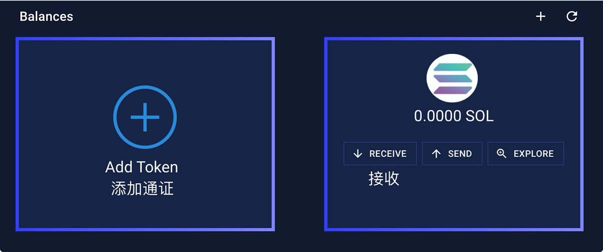
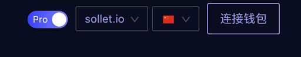
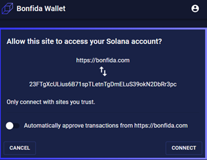
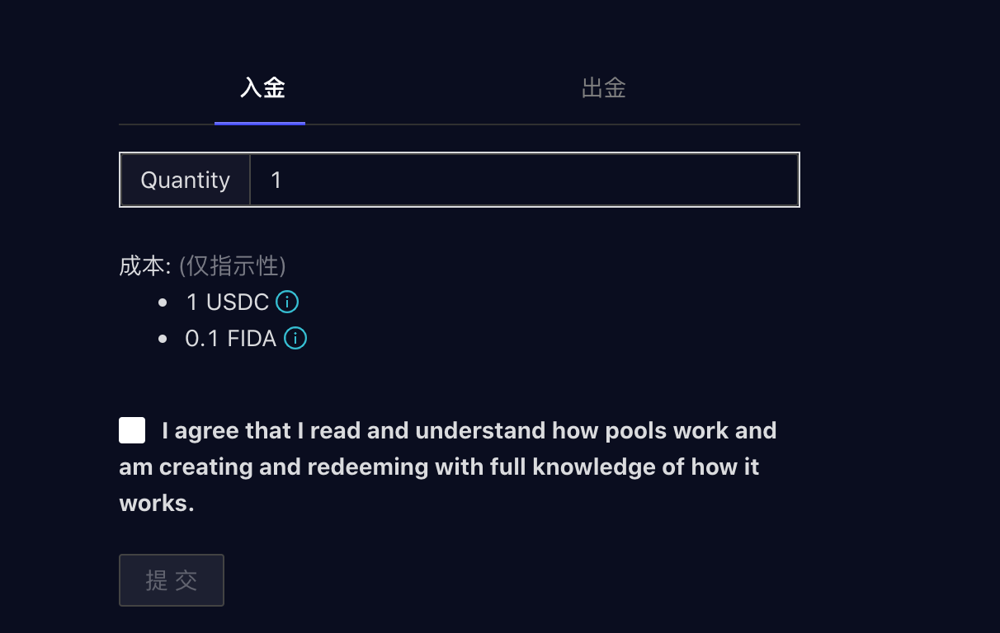
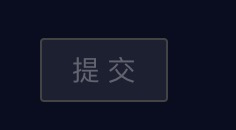
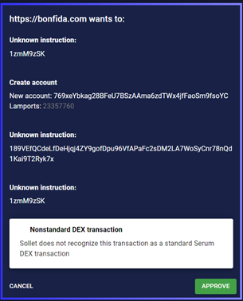
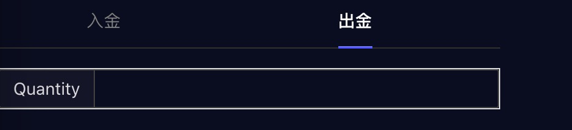

## 第一步：创立钱包（Bonfida钱包创建）

Sollet钱包请参考https://serum-academy.com/zh/serum-dex/sol-wallet/

- 前往 Bonfida Wallet
   - Create new wallet（创建新的钱包，请注意一定要保存助记词，仅仅会在创建钱包时出现一次）或者;
   - Restore existing wallet （登录/重置已有的SPL钱包）

- 选择RECEIVE,出现该钱包的SOL接收地址,用来从其他平台接收SOL（如FTX）。Bonfida钱包内添加其他通证 （如USDC，FIDA等）需要消耗0.002039 SOL矿工费。同时请注意在DEX上交易也会消耗SOL，大约$10用于100万次交易。这一次OXY  IDO大约需要0.5 SOL

- 请注意这一次OXY IDO，USDC+FIDA入金比率为10：1， 每10个USDC需要1个FIDA

- 选择ADD，并添加FIDA通证到账户中

选择ADD，并添加USDC通证到账户中

## 第二步: 参与IDO 

- 前往 Serum | Bonfida - 官方IDO网址，右上角可以切换语言到中文版本

- 请连接钱包

- 在弹出窗口中选择“CONNECT”允许接通钱包，并确保不要关闭该窗口用于后续每条交易确认（若您已选择auto-approve自动允许也勿关闭此窗口）

- 点击“入金”并且输入想购买OXY的USDC的金额（会自动根据10：1算出需要的FIDA金额）

请勾选免责声明：我已阅读并知晓池子如何运作，操作“申购”以及“赎回”都是基于对池子运作的充分认知。

- 点击“提交”

- 选择“APPROVE”确认交易。网页会在钱包页面弹出确认交易信息窗口，点击“APPROVE”确认交易。

- USDC和FIDA会被存入OXY池中. 3.16号晚上9:55 至 10:00, 系统会自动将USDC置换成对应份额的OXY通证，用户届时可取回FIDA通证

- 请点击“出金“来提取代币

- 选择“提交”

- 选择“APPROVE”确认交易，池中的通证会被转移到用户钱包里。

- OXY & FIDA 通证现在会出现在用户钱包之中

