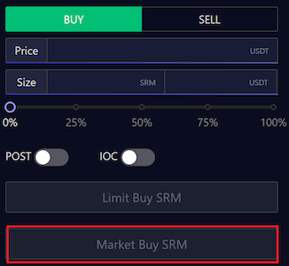

Let’s say you need a trade to execute immediately, and you don’t want to wait for the market to fill you. Bonfida is currently the only Serum GUI to offer market orders. In essence, a market order simply throws the trade you want executed right at the book, and you get filled based on what’s available. You will not have to wait to get filled, it can be thought of as a swap except that you can have a better visual gauge of the potential slippage you might incur.

