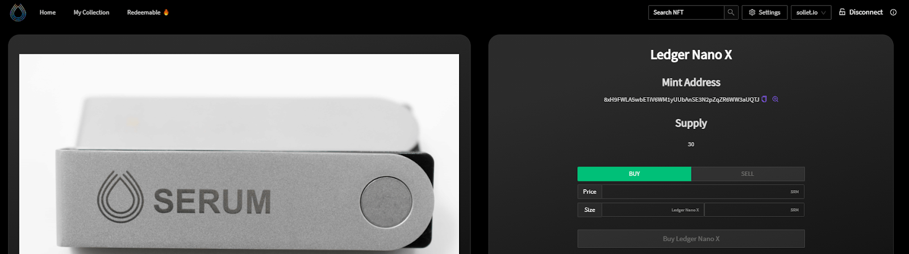
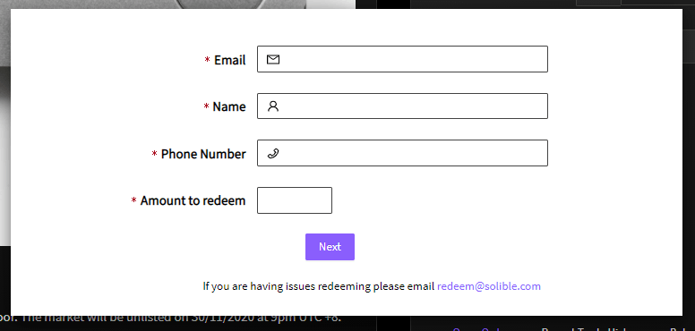

可以通过访问拍卖页面进行商品兑换。在这里我们将使用[Serum Ledger Nano X](https://solible.com/#/trade/327ubUZkUUAEdeWvyQYh1Ycs9mt6yDnt7jDAW47U3krw)举例。

首先，需要连接您持有通证的钱包，一旦连接完成，**兑换**按钮将变成可用状态。

接下来，在弹出的表格中填写您的配送信息并提交。

最后，批准交易。一旦交易确认，就意味着您已经成功的兑换了NFT。现在只需要等待它快递至您的地址。在兑换 NFT 24小时内，您将会收到一封确认邮件。

