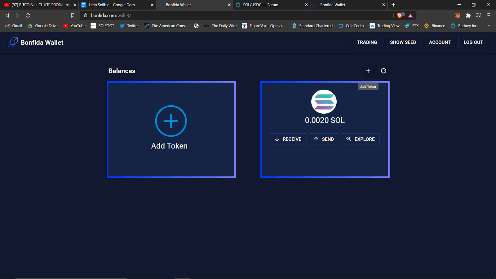
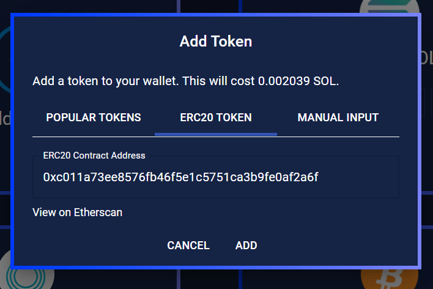

当你开始使用标准Bonfida钱包时，默认只有一个SOL地址。这类似于 MetaMask只有以太坊的部分。想要添加通证，需要进入钱包页面，点击“添加通证”，您将会看到有二十多个热门币种的清单。如果您看到了需要的通证，请点击“添加”。

在添加通证之前，您需要展开来查看它的铸造地址。

## ERC20

您可以在Bonfida钱包中添加ERC20通证，接下来这个通证地址会自动转换成Solana版本（这将是映射的通证）。

## 手动输入

如果想要添加默认列表之外的通证，您需要访问**手动输入**界面，通过和MetaMask相同的方式进行操作。

