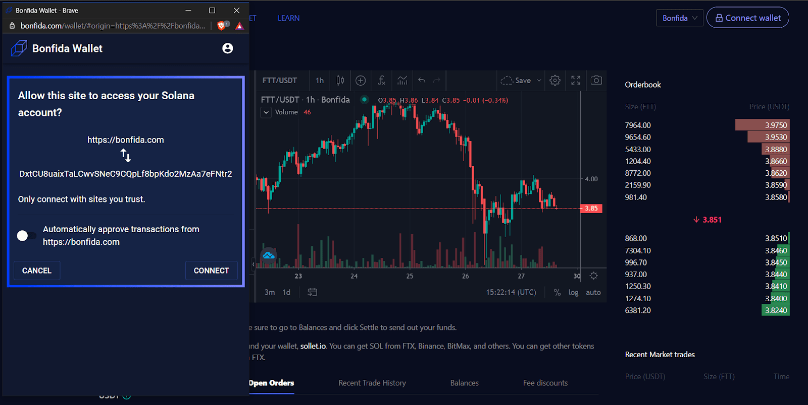
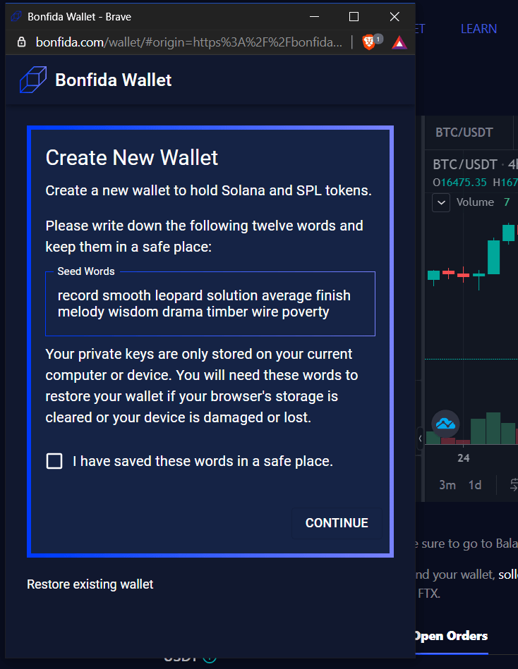

Bonfida钱包可以连接Bonfida的全套产品 - 目前包括[Bonfida DEX](https://bonfida.com/dex/#/)、[Swap](https://swap.bonfida.com)、以及基于Serum搭建的NFT交易所[Solible](https://solible.com)。

## Bonfida DEX & Solible

所有Bonfida产品在右上角都有一个下拉菜单，您可以选择想要连接的钱包，默认的是Bonfida钱包。

在点击“连接”之后，会出现确认按钮。

当您忘记密码、忘记账户、或者意外清空了浏览器缓存时，可以使用**恢复已有账户**功能。您需要输入助记词才可以使用该功能。

## 忘记密码？

点击**恢复已有账户**，输入您的助记词，接下选择一个密码。请注意，密码是可选的。

## 切换账户

Bonfida钱包支持多个账户（可以理解为类似FTX交易所的子账户）。

