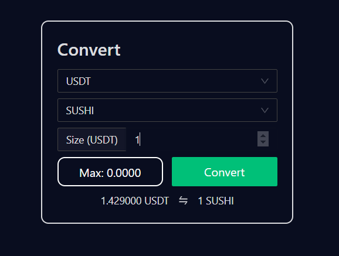

As of now, there are two ways to convert a token within the Serum ecosystem:

## DEX

The convert function within the [Bonfida GUI](https://bonfida.com/dex/#/) will **only appear once you have connected your wallet**.

## SWAP

Also accessible from the header of Bonfida, [Serum Swap](https://swap.bonfida.com) has numerous listings available (including BTC, ETH, SOL, SRM, YFI, LINK, UNI ...) for you to try

With the pools in [Serum Swap](https://swap.bonfida.com), you may also provide liquidity for fees and an estimated APR averaging from 20 to 30% on some pairs.

Read more on [Project Serum Swap](https://swap.bonfida.com/#) AMM and its pool on [Serum Academy](https://serum-academy.com/en/serum-swap/)
