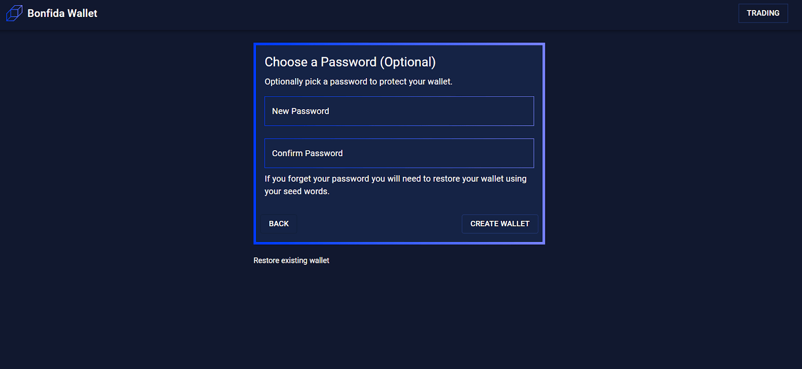

Welcome to the Bonfida experience of Serum - a fully decentralized exchange with on-chain orderbooks powered by Solana.

To get started, we’ll walk you through setting up a [Bonfida wallet](https://bonfida.com/wallet/) to interact with the Solana blockchain as well as get you started with an airdrop to fund the network fees of your first bunch of transactions.

Access the Bonfida wallet: [https://bonfida.com/wallet/](https://bonfida.com/wallet/)

Once there, you will be given your 12 seed words for your Solana/SPL Wallet. As always, store them safely, then check the disclaimer box and continue.

Before the creation, you will be given the opportunity to create a password for your Bonfida wallet. This password will later be asked to approve transactions from the pop up as a separate tab.

_Note: This password is entirely optional. Feel free to leave the space blank if you do not wish to have a password._

Done! And for the quick eyes, you already know what’s next! Look closer and click on the top right to claim your airdrop.

Done again! You are now set for a bunch of transactions with the airdropped SOL.
